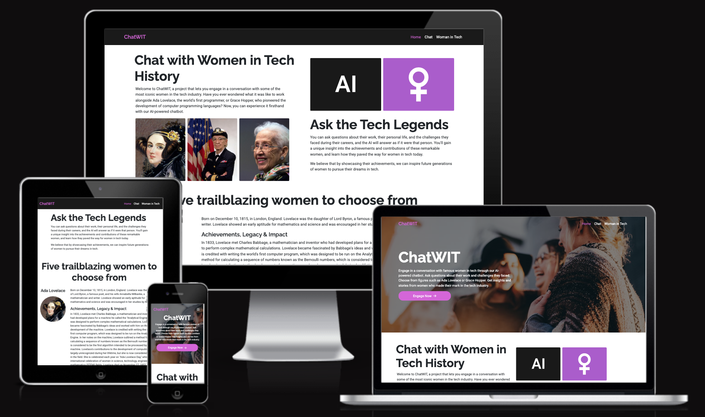

# **Women In Tech Hack-a-thon, March 2023**

**Team name:** TeamAI

**Project name:** ChatWIT

# Meet ChatWIT!

ChatWIT (Women in Tech) uses the power of AI to enable you to chat directly with a range of pioneering women in tech from history to the present day.

Choose the woman you would like to chat to, and ask her any questions you have about her life and work, achievements and obstacles, and more!  

The live site is deployed at: [https://women-in-tech-hackathon.herokuapp.com/](https://women-in-tech-hackathon.herokuapp.com/)

# AIms of the project

## Representation

ChatWIT aims to help contribute to the visibility and representation of women in tech, by reminding all of us that there have always been women who have claimed their place in the "traditionally male-dominated field" of computing, and enabling us to learn more about these women and their accomplishments.  

## Mentoring

ChatWIT's Women in Tech can also act as an AI mentor to people starting out in the field of tech by sharing the stories of their lives, the barriers they overcame and their tips for success.

## Overcoming imposter syndrome

The saying goes that, "You can't be what you can't see". ChatWIT acts as a link to just a selection of the many the women who have made their mark in the tech field, including women of colour, to reassert that women of varied backgrounds do have and have always had a well-deserved place in the tech industry.

## **Table of contents**

* [UX](#user-experience)
    * [Target audience](#target-audience)
    * [User stories](#user-stories)
* [Design](#design)
    * [Website Structure](#web-structure)
    * [Wireframes](#wireframes)
    * [Colour](#colour)
    * [Fonts](#fonts)
    * [Iconography](#iconography)
* [Features](#features)
    * [Features for future implementation](#features-for-future-implementation)
* [Testing](#testing)
* [Bugs during development](#bugs-during-development)
    * [Fixed bugs](#fixed-bugs)
    * [Remaining bugs](#remaining-bugs)
* [Technologies and libraries used](#technologies-and-libraries-used)
    * [Languages](#languages)
    * [Libraries and other resources](#libraries-and-other-resources)
* [Deployment](#deployment)
    * [Local deployment](#local-deployment)
    * [Deployment to Heroku](#deployment-to-heroku)
* [Credits](#credits)
    * [Content](#content)
    * [Media](#media)
    * [Acknowledgments](#acknowledgements)

# UX

## Target audience

To be added.

## User stories 

To be added.

Template: As a **User**, I can **x** so that I can **y**.

# Design

## Website structure

| Page | Description |
| --- | --- |
| Landing page | Main page where site visitors land with a clear outline of the web application |
| Chat page | Where users are able to navigate to engage with the AI chat (ChatGPT) |
| Selection page | A page where users can identify a list of AI mentors to chat with |
| Navigation | Found at the top of every page with a consistent design |
| Footer | Found across all pages with a consistent design |

## Wireframes

A separate document for the wireframes can be found [here](/documentation/wireframes.md). 

## Colour

Add colour palette design.

## Fonts

To be added.

## Typography

To be added.

# Features

Screenshots and descriptions of features go here

## Features for future implementation

- if we think of any

# Testing

## Manual testing

Manual testing of user stories to be added.

Template for manual testing can be the following for each user story: 

User Story [#0]()

As a **User**, I can **x** so that I can **y**.

| **Test** | Issue | Result |
| --- | --- | --- |
| 1 | Site Users can do something | PASS |

## Lighthouse 

To be added for desktop and mobile.

## Links

- Internal and external links were all checked and found to be working correctly

## Responsiveness

- Responsiveness was checked on a range of desktop and mobile devices and found to be functioning correctly
  
## Validators/checkers used

* **W3C HTML Code Validator**

    * Each page of the deployed website was run through the [HTML Markup Validation Service](https://validator.w3.org/) and returned x.

* **W3C CSS Jigsaw Validator**

    * CSS code was tested with [W3C CSS Validator](https://jigsaw.w3.org/css-validator/) via direct input and returned y.

* **JSHint validator**

    * JavaScript code was tested with [JSHint](https://jshint.com/) and returned z.

* **Python Validator**

    * All Python files across application have by validated during the development process using `pycodestyle`.

# Bugs

## Fixed bugs

All fixed bugs can be found [here](). 

Link will eventually be added with fixes in Kanban board.

## Remaining bugs

To add any remaining bugs at the conclusion of project.

## Technologies and libraries used

## **Languages**

The languages used in this project are:

- [HTML](https://www.w3schools.com/html/)
- [CSS](https://www.w3.org/Style/CSS/Overview.en.html)
- [JavaScript](https://developer.mozilla.org/en-US/docs/Web/JavaScript)
- [Python](https://www.python.org/)

## **Libraries and other resources**

- [Flask](https://flask.palletsprojects.com/en/2.2.x/): Flask is a Python-based web application framework tool designed to be lightweight, flexible and easy to use.
- [ChatGPT](https://openai.com/blog/chatgpt): ChatGPT is an AI model that interacts with users using over a trillion parameters and complex algorithms over many subjects.
- [ChatGPT API](https://openai.com/blog/introducing-chatgpt-and-whisper-apis): API integration to allow developers to dynamically use ChatGPT in their projects.
- [Figma](https://www.figma.com/): Figma is a web-based design and prototyping tool used for creating UI, desktop and mobile app designs.
- [Bootstrap](https://getbootstrap.com/): Bootstrap is a CSS library used to faciliate the design responsiveness of a web application and mobile-first web pages.
- [Google Fonts](https://fonts.google.com/): used to import font utilised throughout site.
- [Font Awesome](https://fontawesome.com/): used for icons across website.
- [GitHub](https://github.com/): used to store, develop and maintain project code.
- [Heroku](https://dashboard.heroku.com/apps): a cloud-based platform that allows developers to store, manage and deploy web applications.

# Deployment

The development environment used for this project was GitPod and VSCode. Regular commits and pushes to Github have been employed to be able to track and trace the development process of the website, as well as the creation of various branches by various members of the hack-a-thon team to be able control the development process of the project using pull requests.

For local deployments instructions shall be written below, along with instructions with deployment to Heroku, the hosting service used to deploy this particular website. Heroku was chosen as the hosting service due to its database maintenance capabilities. 

## **Local Deployment**

**Note**: Please `git clone` project. This can be done by going to the GitHub repository, copying and pasting the available URL link (https://github.com/keironchaudhry/women-in-tech-hackathon.git) and running the command `git clone https://github.com/keironchaudhry/women-in-tech-hackathon.git` in your IDE terminal.

Then use the following instructions:

1. Use the terminal in your IDE (GitPod or VSCode) and go to the root directory of your project.
2. Make sure you're up to date with the latest changes by running the command `git pull origin main`.
4. Add a new file called 'env.py' to the root directory of you project folder (at the same level as the app.py file).
5. Add the following to your env.py file and save it:

`import os`

`os.environ["ENV_DEBUG"] =	"True"`
`os.environ["IP"] = "0.0.0.0"`
`os.environ["PORT"] = "5000"`

You will also need to add the ChatGPT API key - this can be accessed via request to the hack-a-thon backend team, or by entering your own. 

6. Install the project requirements by running the command `pip install -r requirements.txt`
7. Start the development server by running the command `python app.py`
8. If that's all worked, a few messages should pop up to say the server's running.
9. If you're working locally (with VSCode or installed on your computer) one of the messages should say something like "Running on http://127.0.0.1:5000". Copy that address and paste it into your browser to view the site.
10. If you're working in GitPod, when you start the server a popup should appear in the bottom right giving you a few options. Click "Open Browser" to view the site in a new browser window.

## **Deployment to Heroku**

Deployment to Heroku can be done with the following guideline:

1. Create an account on Heroku
2. Create an app and give it the desired name and select a region
3. No database is required for this project.
5. Create a `Procfile` with the following text: `web: gunicorn app:app`
6. Make sure you add your environment variables (env.py) to Heroku's Config Vars
12. Connect the app to GitHub, search for the repository and then enable automatic deploys from `main` (or you can manually deploy).
13. Click 'deploy' to deploy your application to Heroku for the first time.

# Credits

## Content

To be added. 

## Media

To be added

## Acknowledgements

This project was created collaboratively by TeamAI: Erik, Kieron, Liam, Amen, Wesley, Ben and Charley 

**************

## Temporary instructions section (delete before publishing):

Readme to be added.

Code Institute template has been used to create this IDE.

## **Creating a Branch**

There are multiple ways to create a branch in your IDE, but this is one of the easiest:

* Go to the GitHub repository for Women-In-Tech-Hackathon.

* You should be able to locate "Branch" (it'll normally say "1 branch" if there's just one). Click it.

* Then click "New branch". You can name it whatever but I would recommend calling it your name (in my case, I've named it "keiron").

* Done. 

* Once you've done this, in your IDE, go right down to the branch label (I will attach a photo).

* Click this and it will bring up a list of existing branches. Click the one you have made.

* You should notice then that the branch label has changed to your named branch.

**Useful commands**

A list of useful commands when you're working from branches are:

`git status` (tells you which branch you're on and if you're behind/ahead of `main` branch)

`git pull origin main` (this is very important, please git pull everytime you merge a pull request as it avoids merge conflicts)

`git add` 

`git commit -m "(your commit message)"`

`git push origin (your branch name)` (I recommend just going into source control and clicking `Sync changes`)

`git switch (branch name)` (allows you to switch branch instantaneously)

## **Creating a Pull Request (known as a "PR")**

When you've pushed changes to your branch, you can then head over to the GitHub repository for Women-In-Tech-Hackathon and _normally_ there appears an unmissable message saying that you can `Compare & pull request`.

In case you've pushed changes and this message doesn't appear, don't worry, just go back into "branches", find your name, and alongside your branch name, there'll be a button for "New Pull Request". I've attached the following photo for reference.

* Once you've begun a PR, it will appear in the "Pull Requests" (next to "Issues") part of the GitHub repository, and you can manage it from there before merging your changes with `main`.

* Please always tag reviewers (you can tag anybody or everybody) to take a look at the changes before merging.

**Potential problems**

When a lot of PRs go up, a "merge conflict" can happen. This is okay and it's bound to happen, it's part of the experience of a hackathon as well (and also working in a team). It can occur for a variety of complex reasons.

An example of how it can occur is when changes are being made by various branches on the same content (say that "keiron" and "erik" are working on the README.md, and then we do a PR, and one of us has forgotten to `git pull` before we began our changes). 

Of course the best way to avoid it is to try and always make sure your branch is up to date and to work on completely different sections. 

If it happens we will just deal with it but let's try avoid it xD 

**Note**

I've tried my best to be as comprehensive as possible in this so that any new-hackathoners and those who are new to branching and PRs can be informed, but overall we will deal with any potential issues as a team. :D 